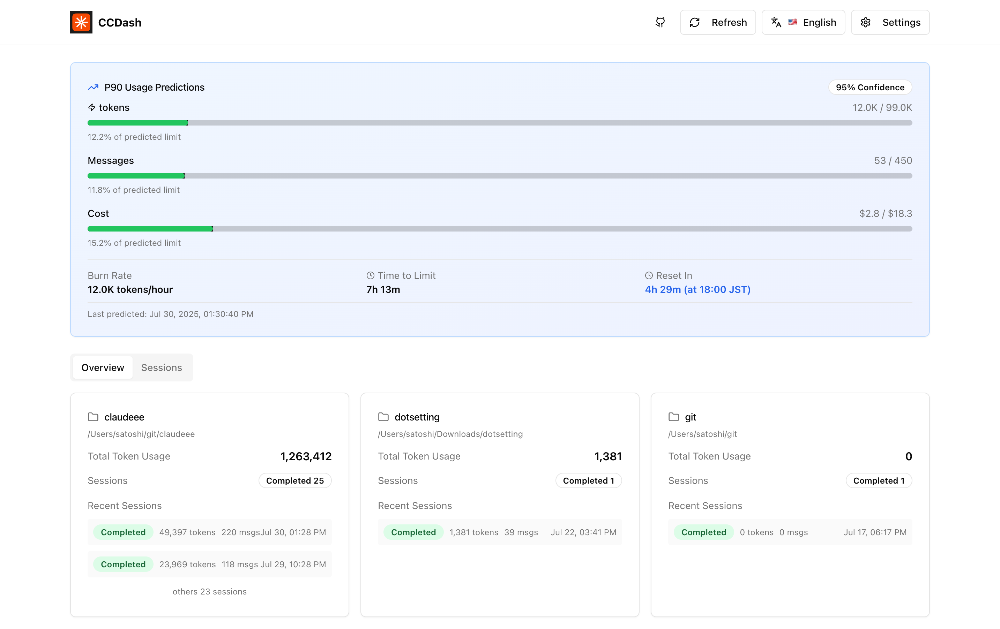

# CCDash

A monitoring dashboard for Claude Code usage and session management.



## Quick Start

```bash
# Run instantly
npx ccdash

# Or install globally
npm install -g ccdash
ccdash
```

Access at: http://localhost:3000

## Features

- **Token Usage Monitoring** - Track usage within 5-hour windows with reset times
- **Session Management** - View sessions by project with token usage and execution time
- **Automatic Sync** - Parse Claude Code logs and sync to database

## Development Setup

### Prerequisites
- Go 1.21+
- Node.js 18+

### Installation
```bash
git clone <repository-url>
cd ccdash

# Backend
cd backend && go mod download

# Frontend  
cd frontend && npm install --legacy-peer-deps
```

## Commands

```bash
# Production
npx ccdash

# Development  
npx ccdash dev

# Custom frontend port
npx ccdash --frontend-port 3001

# Custom frontend URL
npx ccdash --frontend-url https://app.example.com

# Specify API key
npx ccdash --api-key your-secret-key-here
npx ccdash -k your-secret-key-here

# Other commands
npx ccdash build
npx ccdash help
npx ccdash version
```

**Note**: Backend runs on port 6060 (fixed)

## Tech Stack

**Backend**: Go, Gin, DuckDB  
**Frontend**: Next.js, TypeScript, Tailwind CSS, shadcn/ui

## Manual Setup (Development)

```bash
# Backend
cd backend && go run cmd/server/main.go

# Frontend (new terminal)
cd frontend && npm run dev
```

## Production Deployment

For production with custom domains, use nginx reverse proxy (see `nginx/README.md`)

## Troubleshooting

### Common Issues

**Database Lock Error**
```bash
rm -f ~/.ccdash/ccdash.db*
```

**Frontend Dependency Error**  
```bash
cd frontend && npm install --legacy-peer-deps
```

**CORS Error**  
Use nginx reverse proxy (see `nginx/README.md`) or use localhost with custom ports.

## Security Configuration (Phase 0)

CCDash now includes basic security features to protect your deployment:

### API Key Authentication

CCDash automatically generates and manages API keys for secure access:

#### **Automatic Key Generation**
- **First Run**: CCDash generates a secure 256-bit API key automatically
- **Key Storage**: Saved to `.env` file for persistence
- **Console Display**: Key shown during startup (truncated in production mode)

#### **Manual Configuration**
```bash
# Method 1: Command line option (recommended for temporary use)
npx ccdash --api-key your-secret-key-here
npx ccdash -k your-secret-key-here

# Method 2: Environment variable
export CCDASH_API_KEY=your-secret-key-here
npx ccdash

# Method 3: Add to .env file (recommended for persistent use)
echo "CCDASH_API_KEY=your-secret-key-here" >> .env
npx ccdash
```

#### **Security Modes**
- **Development Mode** (`GIN_MODE=debug`): Shows full key in console
- **Production Mode** (`GIN_MODE=release`): Shows truncated key for security

### Command Safety Check

CCDash uses Claude Code to analyze command safety before execution. This prevents dangerous operations while allowing flexible natural language commands.

**Safety Check Modes:**

1. **Default Mode (YOLO - Safety Disabled)**
   ```bash
   npm run dev
   # Default: COMMAND_WHITELIST_ENABLED=false (YOLO mode)
   ```

2. **Enable Safety Check**
   ```bash
   # Method 1: Environment variable
   COMMAND_WHITELIST_ENABLED=true npm run dev
   
   # Method 2: .env file
   echo "COMMAND_WHITELIST_ENABLED=true" >> .env
   ```

3. **Disable Safety Check (NPX option)**
   ```bash
   # NPX command option
   npx ccdash --no-safety
   ```

4. **Disable API Authentication**
   ```bash
   # NPM script
   npm run dev:no-auth
   
   # NPX command option
   npx ccdash --no-auth
   ```

5. **Disable All Security (Development Only)**
   ```bash
   # NPM script (disables both safety check and auth)
   npm run dev:unsafe
   
   # NPX command option  
   npx ccdash --no-safety --no-auth
   ```


**⚠️ WARNING**: Disabling safety checks allows ALL commands to execute without validation. Use only in trusted environments.

### HTTPS Setup

For production deployments, use HTTPS to encrypt all communications:

See [nginx/README.md](nginx/README.md) for complete HTTPS setup guide with nginx configuration.

### Environment Variables

Copy the example files and configure:
```bash
cp backend/.env.example backend/.env
cp frontend/.env.example frontend/.env.local
```

See the `.env.example` files for all available options.

## License

MIT License
